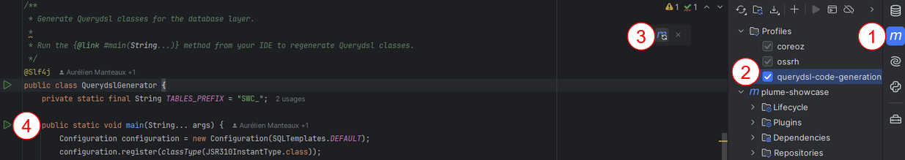

This release is the biggest Plume release, by features and by breaking changes. We strived to make the upgrade as fast as possible and as documented as possible. On most projects, the migration should not take more than 1 hour of work. However, what can be time-consuming is to upgrade other dependencies that haven't yet migrated to Jakarta EE (mostly dependency injection or Jersey web-service). If there is an upgrade issue, please [reach out](https://github.com/Coreoz/Plume/discussions).

About the beta release: no big change is expected before the final release version. This beta version has been tested, but since the changes of this release are bigger than usual, we prefer to release first a non-final version that is more likely to contain small bugs that we will fix in the final version. Please share all the issues you might encounter with this beta version.

Changelog
-------------
- Java EE -> Jakarta EE
- JUnit 4 -> JUnit 5
- Dependencies upgrade
- Java 20+ support
- Enables HikariCP and Grizzly threads pool monitoring
- Add [Jersey request max content size verification](https://github.com/Coreoz/Plume/tree/master/plume-web-jersey#content-size-limit) to improve security and avoid denial-of-service attacks
- Fix timing attack on the basic authentication service
- [Pagination for plume-db-querydsl](https://github.com/Coreoz/Plume/tree/master/plume-db-querydsl#pagination)
- [Use by standard `Clock` instead of the custom `TimeProvider`](https://github.com/Coreoz/Plume/issues/39)
- Add plume-test module
- #26 Add nullable annotations for better Kotlin integration
- Review how Swagger UI is used to enable to use the latest version of the UI

Upgrade instructions from 4.x to 5.x
-------------------------------------
These instructions are meant to be followed one step after the other.

If Plume file v1 is used, the guide will need to be followed after finishing migrating [upgrade to Plume file latest version](https://github.com/Coreoz/Plume-file/releases).

### Jakarta EE
- Either Intellij using the main menu (on the top bar): Refactor > Migrate Packages and Classes... > Java EE to Jakarta EE
- Either by running the [openrewrite migration plugin](https://docs.openrewrite.org/recipes/java/migrate/jakarta/javaxmigrationtojakarta): `mvn -U org.openrewrite.maven:rewrite-maven-plugin:run -Drewrite.recipeArtifactCoordinates=org.openrewrite.recipe:rewrite-migrate-java:RELEASE -Drewrite.activeRecipes=org.openrewrite.java.migrate.jakarta.JavaxMigrationToJakarta -Drewrite.exportDatatables=true`

Note that after the automatic upgrade, the project will not find Jakarta dependencies, that's normal, it will be added in a later step.

### JUnit 5 automatic upgrade with Intellij
If using Intellij, use: `Refactor > Migrate Packages and Classes... > Unit (4.x -> 5.0)`.
Note that this feature seems a bit buggy, and it often needs to be launched multiple times.

This automatic upgrade just does the bare minimum upgrade, mostly packages update only.
It's better than nothing, but keep in mind that some manuel update will need to be done later.

### pom.xml file update
There are multiple updates to do in the `pom.xml` file.

#### Java version
Use at least Java 17 if it is not already the case. Java 21 or Java 23 can also be used.

#### Plume version
Reference the new Plume version: `5.0.0-beta2`.

#### Swagger dependency
Replace the Swagger artifact name `swagger-jaxrs2` by `swagger-jaxrs2-jakarta` (the group id `io.swagger.core.v3` remains the same).

#### Plume file
Plume file latest version is now included in Plume dependencies (with the Jakarta upgrade), so the Plume file version should be deleted in the properties and in the dependencies.

#### Guice Bridge
The Guice exclusion from the `guice-bridge` dependency can be removed.

#### Replace javax.servlet-api by jakarta.servlet-api
The dependency `javax.servlet-api` should be replaced by:
```xml
<dependency>
  <groupId>jakarta.servlet</groupId>
  <artifactId>jakarta.servlet-api</artifactId>
</dependency>
```

#### Test dependencies
Tests dependencies junit, assertj, mockito and `guice-junit-test-runner<` can be replaced by:
plume-db-test

#### Plugin versions
Maven plugins versions can be updated, especially if there is an incompatibility with the Java version used.

For example:
- maven-compiler-plugin
- maven-resources-plugin
- maven-jar-plugin
- maven-javadoc-plugin

#### Flyway specific module
Flyway uses a modular system since v10, if used:
- The module `flyway-core` must be included
- An additional module may be required depending on the database used, for example:
  - `flyway-mysql` for MySQL
  - `flyway-database-postgresql` for PostgreSQL

So the correct module depending on the database used must be referenced. See [the list of available module](https://github.com/flyway/flyway/issues/3780) to choose the module to add. 

The versions of Flyway modules for MySQL, PostgreSQL, Oracle and SQL Server are referenced in Plume dependency POM. So for example, with MySQL it can be used like this:
```xml
<dependency>
  <groupId>org.flywaydb</groupId>
  <artifactId>flyway-core</artifactId>
</dependency>
<dependency>
  <groupId>org.flywaydb</groupId>
  <artifactId>flyway-mysql</artifactId>
</dependency>
```

#### Querydsl generation
Since Querydsl still relies on `javax.inject`, this dependency needs to be excluded.

Moreover, just marking `plume-db-querydsl-codegen` as optional does not exclude this dependency and all the transitional dependencies from the final build :(

So the best solution to be able to still execute the Querydsl code generation and exclude all these build dependencies from the final build is to:
- Put the `plume-db-querydsl-codegen` dependency as provided: so the project still builds correctly in the IDE. But in the declaration of this dependency, `javax.inject` must be excluded so it is not proposed by the IDE during auto-complete for `@Singleton` or `@Inject` annotations
- Add a dedicated profile in the `pom.xml` file where the `plume-db-querydsl-codegen` is fully included

So here are the expected changes:

**1. Replace the `plume-db-querydsl-codegen` with:**
```xml
<!-- Querydsl code generation, using the provided scope to avoid compilation error in the IDE -->
<dependency>
    <groupId>com.coreoz</groupId>
    <artifactId>plume-db-querydsl-codegen</artifactId>
    <scope>provided</scope>
    <exclusions>
        <!-- Querydsl codegen still relies on javax.inject for now -->
        <exclusion>
            <artifactId>javax.inject</artifactId>
            <groupId>javax.inject</groupId>
        </exclusion>
    </exclusions>
</dependency>
```
**2. After the `</dependencies>` block, add the querydsl-code-generation profile:**
```xml
<profiles>
    <!-- Profile for querydsl code generation -->
    <profile>
        <id>querydsl-code-generation</id>
        <dependencies>
            <dependency>
                <groupId>com.coreoz</groupId>
                <artifactId>plume-db-querydsl-codegen</artifactId>
            </dependency>
        </dependencies>
    </profile>
</profiles>
```
**3. After the migration, to use Querydsl code generation, follow these steps in Intellij:**
1. Click on the Maven pane on the right
2. In the Profiles block, select the `querydsl-code-generation` profile
3. Update the Maven project
4. Run the `QuerydslGenerator` as before

Here is a picture summing up these steps:


#### Clean up runtime dependencies
Guava includes some unnecessary run dependencies (findbugs, error prone, j2objc annotations and checker qual). To remove them from the production build, add the `distDependencyExcludes` configuration in the `com.google.code.play2-maven-plugin` plugin:
```xml
<!-- build a zip with all the dependencies and starting scripts -->
<plugin>
    <groupId>com.google.code.play2-maven-plugin</groupId>
    <artifactId>play2-maven-plugin</artifactId>
    <version>1.0.0-rc5</version>
    <executions>
        <execution>
            <goals>
                <goal>dist-exploded</goal>
            </goals>
            <phase>package</phase>
        </execution>
    </executions>
    <configuration>
        <!-- Exclude guava build dependencies from runtime -->
        <distDependencyExcludes>com.google.code.findbugs:jsr305,com.google.errorprone:error_prone_annotations,com.google.j2objc:j2objc-annotations,org.checkerframework:checker-qual</distDependencyExcludes>
    </configuration>
</plugin>
```

### Swagger upgrade
Swagger has been upgraded, and it is not possible anymore to use the query parameter `url`: https://github.com/swagger-api/swagger-ui/issues/7702

To overcome this, Swagger UI is now loaded directly from the `index.html` file of the project using webjars.
This file generally contained this:
```html
API Swagger documentation:
        <a href="webjars/swagger-ui/4.1.2/index.html?url=/api/swagger">
            webjars/swagger-ui/4.1.2/index.html?url=/api/swagger
        </a>
```
And now the file should be updated with:
```html
<head>
  <!-- current head tag content should remain unchanged -->

  <!-- head tag content to be added: new links to updated swagger-ui -->
  <script src="webjars/swagger-ui/5.17.14/swagger-ui-bundle.js" charset="UTF-8"></script>
  <script src="webjars/swagger-ui/5.17.14/swagger-ui-standalone-preset.js" charset="UTF-8"></script>
  <link rel="stylesheet" href="webjars/swagger-ui/5.17.14/swagger-ui.css">
</head>
<body>
  <div id="swagger-ui"></div>
  <script>
    SwaggerUIBundle({
      url: "/api/swagger",
      dom_id: '#swagger-ui',
      presets: [
        SwaggerUIBundle.presets.apis,
        SwaggerUIStandalonePreset
      ],
      layout: "StandaloneLayout"
    });
  </script>
</body>
```

After the update, Swagger UI will be accessible on the URL http://localhost:8080/ instead of http://localhost:8080/webjars/swagger-ui/4.1.2/index.html?url=/api/swagger

### TimeProvider deprecated to use Clock instead
The `TimeProvider` class has been deprecated: it was a custom solution that wasn't easy to use in non-Plume projects and that is actually resolved by the Java based standard `Clock` object.

Replace the use of `TimeProvider` by the `Clock` object:
- `timeProvider.currentTime()` => `clock.millis()`
- `timeProvider.currentInstant()` => `clock.instant()`
- `timeProvider.currentLocalDate()` => `LocalDate.now(clock)`
- `timeProvider.currentDateTime()` => `LocalDateTime.now(clock)`

To facilitate testing the `Clock` usage, the [Plume test module](https://github.com/Coreoz/Plume/tree/master/plume-test) can be used.
It contains especially the `MockedClock` class that provides methods to change the time in the injected `Clock` object.

### Finish JUnit 5 upgrade
#### Basic JUnit 5 upgrade
If the automatic upgrade has been performed, this step will be easier.

Follow the [official JUnit migration guide](https://junit.org/junit5/docs/current/user-guide/#migrating-from-junit4-tips).

One migration case that is often encountered is the test exception handling:
- JUnit 4: `@Test(expected = SomeException.class)`
- JUnit 5 (see the [stackoverflow Q/A](https://stackoverflow.com/a/40268447) for details):
```java
MyException thrown = assertThrows(
    SomeException.class,
    () -> myObject.doThing(),
    "Expected doThing() to throw, but it didn't"
);

assertTrue(thrown.getMessage().contains("Stuff"));
```

#### Guice runner upgrade
The new package [Guice JUnit](https://github.com/Coreoz/Guice-Junit) has been included in Plume to run easily JUnit 5 tests that require Guice dependency members. This replaces the [non maintained JUnit 4 Guice integration](https://github.com/caarlos0-graveyard/guice-junit-test-runner) referenced by Plume < v5.0.0. The migration to use Guice JUnit is straightforward:
- Remove the line `@RunWith(GuiceTestRunner.class)` from tests
- Replace the line `@GuiceModules(MyModule.class)` by `@GuiceTest(MyModule.class)`

### Improved security: request max content size verification
A new Jersey feature has been added to limit the size of body requests. This feature mitigates the risk of denial of service.

See [Plume Jersey documentation](https://github.com/Coreoz/Plume/tree/master/plume-web-jersey#content-size-limit) to enable it.

Enabling this feature will improve the robustness of the application, but it can also lead to regressions: some API might require supporting large body requests. So after setting this up:
- A review should be made to try to identify APIs that require large body requests to correctly configure the max content size
- A full testing of the application should be performed

Enabling this feature has a frontend impact: the new I18N error key `CONTENT_SIZE_LIMIT_EXCEEDED` will be returned when the request content size exceeds the limit.

### Improved security: set Jackson limits for API consumption
It is not mandatory for the upgrade, but it is advised to set limits to the JSON parser used for API consumption.
If okhttp and/or retrofit are used with Jackson, the Plume Web Jersey module documentation shows [how Jackson can be configured to set these parsing limits](../../plume-web-jersey/README.md#jackson).

### JJwt update
If JJwt is manipulated directly, some changes are required: https://github.com/jwtk/jjwt/blob/0.12.0/CHANGELOG.md

A migration sample can be found in the [Plume Admin JJwt migration](https://github.com/Coreoz/Plume-admin/commit/2b64ca61ddb30f49159aa2a3c3bfed9ebf736a9c).

### Transaction manager
No migration is required except if `TransactionManager` or `TransactionManagerQuerydsl` are created manually.

In `QueryDSLGenerator`, the data source must be provided in the Guice injector creation: `Injector injector = Guice.createInjector(new GuiceConfModule(), new DataSourceModule());`

Moreover, if `TransactionManager` or `TransactionManagerQuerydsl` were created manually (for example, if multiple databases are used), their creation must be updated using the `HikariDataSources.fromConfig()` method, e.g. : `HikariDataSources.fromConfig(config, "db.hikari")` to create the `DataSource` argument.

### QuerydslGenerator
The `DataSource` module is now separated from the `TransactionManager`, so:
- The line: `Injector injector = Guice.createInjector(new GuiceConfModule());`
- Must be replaced by: `Injector injector = Guice.createInjector(new GuiceConfModule(), new DataSourceModule());`

### Monitoring - Jackson metrics Guice module removal
In the application module, often in the `ApplicationModule` file, the module `GuiceJacksonWithMetricsModule` was required for metrics. This is not the case anymore, and this module has been deprecated for removal in Plume 6.
So in `ApplicationModule`, the `GuiceJacksonWithMetricsModule` should be replaced by the `GuiceJacksonModule`.

### Monitoring - HikariCP and Grizzly
HikariCP threads pool and Grizzly threads pool can now be easily monitored.
To do that:
- In `GrizzlySetup`, in the `start()` method:
    - add the following dependency in the method signature: `GrizzlyThreadPoolProbe grizzlyThreadPoolProbe`
    - declare the prob in the http server configuration: `httpServer.getServerConfiguration().getMonitoringConfig().getThreadPoolConfig().addProbes(grizzlyThreadPoolProbe);`
- In `WebApplication`, fill the new `GrizzlySetup` dependency using `injector.getInstance(GrizzlyThreadPoolProbe.class)`
- In `MonitoringWs`, in the constructor:
    - add the following dependencies in the method signature: `GrizzlyThreadPoolProbe grizzlyThreadPoolProbe` and `HikariDataSource hikariDataSource`
    - Use the metrics: `this.metricsStatusProvider = new MetricsCheckBuilder().registerJvmMetrics().registerGrizzlyMetrics(grizzlyThreadPoolProbe).registerHikariMetrics(hikariDataSource).build()`

The [Plume showcase project](https://github.com/Coreoz/Plume-showcase) has implemented this monitoring.
Browsing the source code can help to verify the required changes. 

### Simple mail java update
Simple mail java now enforces SMTP server identity verification. While this is a better security option, some SMTP servers do not offer this option easily. In these situations, this security configuration option can be disabled:
```hocon
mail."defaults.verifyserveridentity"=false
```

For more information about this security change, see <https://www.simplejavamail.org/security.html#section-transport-strategy-smtp>.

### Jaxb
The jaxb dependencies have been removed. Most of the time, all the dependencies that rely on this library will be removed/updated during the Plume 5 migration. In some rare cases, some or all these dependencies need to be added:
```xml
<dependency>
    <groupId>javax.xml.bind</groupId>
    <artifactId>jaxb-api</artifactId>
    <version>2.3.0</version>
</dependency>
<dependency>
    <groupId>com.sun.xml.bind</groupId>
    <artifactId>jaxb-core</artifactId>
    <version>2.3.0</version>
</dependency>
<dependency>
    <groupId>com.sun.xml.bind</groupId>
    <artifactId>jaxb-impl</artifactId>
    <version>2.3.0</version>
</dependency>
```
