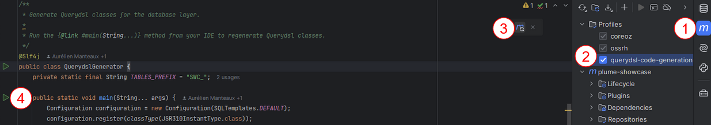

Plume Querydsl Codegen
======================
Generates entities for Querydsl and especially the
[Plume Querydsl module](https://github.com/Coreoz/Plume/tree/master/plume-db-querydsl)

A usage example is available
[in the demo project](https://github.com/Coreoz/Plume-demo/blob/master/plume-demo-full-guice-jersey/src/main/java/com/coreoz/demo/db/QuerydslGenerator.java).

To run the `QuerydslGenerator` class on IntelliJ, the Maven `querydsl-code-generation` profile must be used for that, so these steps must be followed:
1. Click on the Maven pane on the right
2. In the Profiles block, select the `querydsl-code-generation` profile
3. Update the Maven project
4. Run the `QuerydslGenerator` as before

Here is a picture summing up these steps:


Installation
------------
**Maven**:
```xml
<dependency>
  <groupId>com.coreoz</groupId>
  <artifactId>plume-db-querydsl-codegen</artifactId>
  <optional>true</optional>
</dependency>
<!-- do not forget to also include the database driver -->
```

